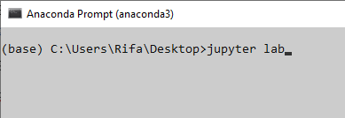
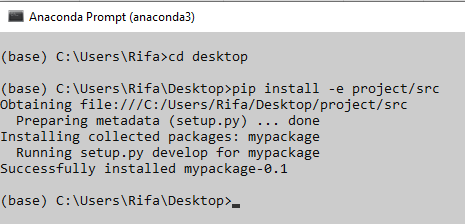

# **Notebooks vs Python Project**
Halo *guys*, dalam mengembangkan *project* atau *project development* perangkat lunak sering kali menggunakan berbagai bahasa pemrograman. Salah satunya adalah bahasa pemrograman python. Tapi tau ga sih, kita kadang belum bisa membedakan antara *notebooks* dan python *projects*. 

*So, let me tell you about the difference.*

Pada* python *projects* yang reguler menggunakan format .py yaitu sebuah *plain text* yang hanya mengandung kode pemrograman python saja, sedangkan *notebooks* menggunakan format .ipynb. Adapun kelebihan dan kekurangan antara python *projects* dan *notebooks,* berikut ini komparasi dari kelebihannya.

| *Phyton Projects*                                      | *Notebooks*                                                                       |
|--------------------------------------------------------|-----------------------------------------------------------------------------------|
| 1. Sangat sederhana dan mendasar                       | 1. Terdapat representasi media dan pemformatan teks                               |
| 2. *Runs* tanpa server atau browser apa pun            | 2. Sudah termasuk instalasi Anaconda                                              |
| 3. Hanya membutuhkan instalasi Anaconda                | 3. Memiliki kemampuan matematika, seperti membuat bagan, grafik, dsb              |
| 4. Memiliki debugger bawaan                            | 4. *Notebook* yang dibuat di Jupyter dapat diakses/edit menggunakan web *browser* |
| 5. Dapat disesuaikan sesuai dengan preferensi pengguna | 5. Sudah termasuk *debugger*                                                      |
| 6. Secara otomatis menyimpan perubahan membuat kode    |                                                                                   |

Adapun komparasi dari kekurangan *python projects* dan *notebook,* sebagai berikut.

|**Python *Projects***|***Notebooks***|
|1. File tidak dapat diakses langsung dengan perangkat lain, kecuali disalin / dikirim|1. Tidak dapat bekerja secara offline, sehingga memerlukan server dan web *browser*|
|2. Perubahan tidak disimpan secara otomatis saat membuat kode|2. Instalasinya membutuhkan waktu lebih lama daripada IDE lain|
|3. Tidak disarankan untuk mengembangkan program yang kompleks dan menggunakan banyak library|3. Mengaksesnya dengan localhost secara *default*, sehingga harus mengikuti langkah keamanan yang signifikan untuk mengaksesnya dari server lain|

### **Instalasi *Jupyter Notebooks***
Notebooks merupakan suatu software buatan Jupyter. Aplikasi yang paling umum digunakan dalam mengembangkan Jupyter *Notebooks* adalah JupyterLab. Terdapat dua cara umum dalam pengerjaannya, yaitu a) secara lokal menggunakan komputer, dan b) berbasis *cloud.*

1) **Secara Lokal Menggunakan Komputer**

Rekomendasi untuk instruksi resmi untuk *install* JupyterLab yaitu <https://jupyterlab.readthedocs.io/en/stable/getting_started/installation.html>.

Kami lebih memilih untuk instalasi JupyterLab melalui conda:

conda install -c conda-forge jupyterlab

Setelah berhasil instalasi, selanjutnya dapat mengetik jupyter lab di dalam terminal Anaconda Prompt dan tekan *Enter* di *keyboard*, dan JupyterLab akan terbuka secara otomatis di dalam web *browser.*

1) **Berbasis *Cloud***

Jika lebih memilih mengerjakannya berbasis *cloud*, cara mudah dan gratis adalah menggunakan Google *Colab.* Kamu dapat mengakses nya melalui pranala *<https://colab.research.google.com/>*. 

Jika lebih suka mengerjakannya dengan *hardware* pribadi, kami merekomendasikan menggunakan *platform [Grid.ai](https://www.grid.ai/)*. Langkah awalnya kamu harus membuat *session* di Grid.ai*  melalui web *browser*, setelahnya kamu dapat membuka JupyterLab *directory.*

### **Persiapan *Basic Python* *Projects***
*Python Project* dasar dapat dimulai dengan struktur folder sederhana. Struktur yang tepat tergantung pada konteks kasus penggunaan, tetapi paling sering dimulai dengan dua folder yaitu:

1. src untuk file kode (.py scripts).
1. docs  untuk file yang terkait dengan dokumentasi.

File README.md juga sering kali merupakan file untuk menggantikan instruksi umum.
#### **Mengubah *Project* menjadi *Python Package***
Misalkan kita memiliki file mycode.py yang berisi kode. Kode tersebut dapat diubah menjadi *Python package* sehingga fungsi dari kode tersebut dapat diimpor. Untuk melakukan ini, kami membuat folder bernama mypackage (dan pilihan penamaan arbitrer) yang berisi setidaknya 2 hal ini:

1. File bernama  \_\_init\_\_.py . (Bisa kosong)
1. Sebuah file yang berisi kode kita yang bernama  mycode.py (nama arbiter lain).

Terakhir, kami membuat file  setup.py.

import setuptools

setuptools.setup(

`    `name='mypackage',

`    `version='0.1',

`    `author='Himpasikom',

`    `packages=setuptools.find\_packages(),

)

File setup.py ini harus berada di sebelah folder mypackage. Setelah membuat file-file ini, file tersebut akan terlihat seperti berikut:

Sekarang, kita dapat menginstal paket menggunakan perintah:

pip install -e path/to/the/folder/containing/setup.py

Terakhir, setelah menyelesaikan langkah ini, kita dapat mengimpor kode dari package dengan Python, di mana saja di komputer kita!

